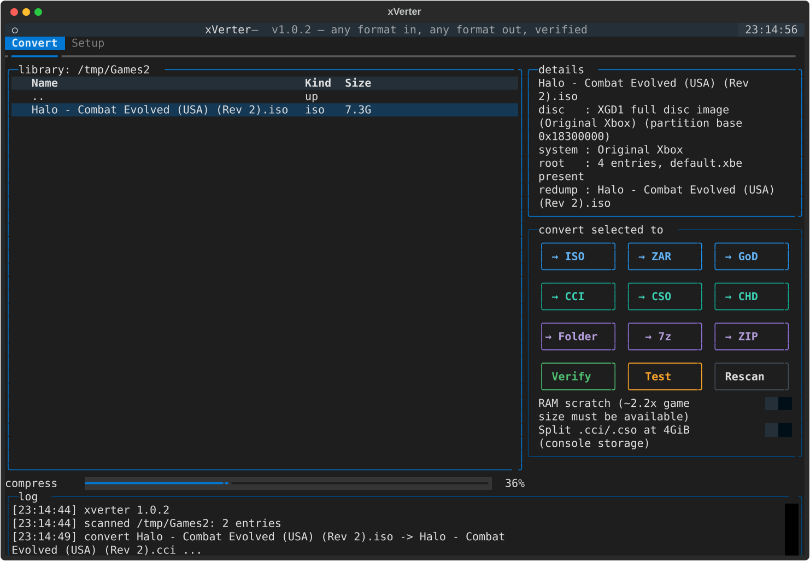
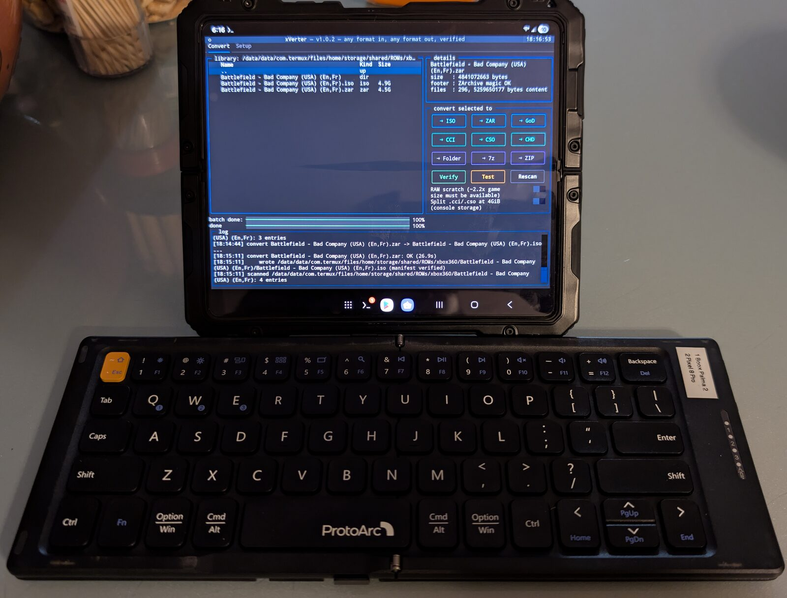

# xVerter

**xVerter: the Xbox 360 — and original Xbox — game format converter: any format in, any format out, verified at every step.**

GoD containers, XDVDFS ISOs (bare or full redump), ZArchive `.zar`, STFS content packages (XBLA/DLC/TUs), CCI, CSO, CHD, `.zip`/`.7z` archives, extracted game directories — `xverter` reads them all, converts between them, shows live progress at every stage, and refuses to call any output "done" until it has been re-read and checked by its own verification code. Every format is read *and written* by xVerter's own pure-Python code — CHD included, as of 1.2.0 — there is no toolchain to assemble.



## Quick start

**The zero-setup way — one standalone file per platform** (from the release page; Python included, nothing to install):

| Platform | File | Then |
|----------|------|------|
| Windows | `xverter.exe` | double-click it — the program opens |
| Linux x86_64 | `xverter-linux-x86_64` | `chmod +x` it once, run it in any terminal |
| Linux ARM64 (Raspberry Pi etc.) | `xverter-linux-arm64` | same — works headless over SSH, mouse included |
| macOS (Apple Silicon) | `xverter-macos-arm64` | same |

Launching with no arguments opens the TUI on the current folder. Testing status, stated honestly: the Windows and Linux x86_64 binaries are click-tested (real conversions driven through the TUI); the ARM64 binary is tested on a Raspberry Pi 5 (TUI renders, conversions verified); the macOS binary is built by CI from the identical code and recipe but **untested — it *should* work**, and a report either way earns you a place in the changelog. (Linux file managers refuse to run terminal programs by double-click — that's a desktop-environment policy, not an xverter quirk; the TUI's Setup tab can install an app-menu launcher entry if you want one.)

**The pip way**, if you'd rather have it as a command:

```
pip install xverter        # or: pipx install xverter
xverter                    # bare = TUI, or:
xverter convert "Some Game.iso" -o "Some Game.zar"
```

No compilers, no external tools — the converters are pure Python, and the few Python packages they use install automatically. From a clone of this repo, `pip install .` gives you the same command.

```
xverter info    <anything>                 # what is this? (magic bytes, never extensions)
xverter verify  <anything>                 # hash trees, structure, redump authentication
xverter convert <anything> -o out.zar      # or out.iso, out.god, outdir/
```

## The matrix

| from \ to              | `dir` | `.iso`   | `.zar` | `.god` | `.cci`   | `.cso`   | `.chd`   | `stfs` |
| ---------------------- |:-----:|:--------:|:------:|:------:|:--------:|:--------:|:--------:|:------:|
| `dir`                  | —     | ✅        | ✅      | ✅      | ✅        | ✅        | ✅        | ❌      |
| `iso`                  | ✅     | —        | ✅      | ✅      | ✅ direct | ✅ direct | ✅ direct | ❌      |
| `zar`                  | ✅     | ✅        | —      | ✅      | ✅        | ✅        | ✅        | ❌      |
| `god`                  | ✅     | ✅ direct | ✅      | —      | ✅ direct | ✅ direct | ✅ direct | ❌      |
| `cci`                  | ✅     | ✅        | ✅      | ✅      | —        | ✅ direct | ✅ direct | ❌      |
| `cso`                  | ✅     | ✅        | ✅      | ✅      | ✅ direct | —        | ✅ direct | ❌      |
| `chd`                  | ✅     | ✅ direct | ✅      | ✅      | ✅        | ✅        | —        | ❌      |
| `stfs` (XBLA/DLC/TU)   | ✅     | ✅*       | ✅      | ✅*     | ✅*       | ✅*       | ✅*      | —      |

**CCI** (Cerbios) and **CSO** (Project Stellar) are the compressed playable formats of the modded original-Xbox hardware scene — block-compressed ISO wrappers, LZ4 throughout. xVerter's writers are **byte-identical to the reference implementations** (Repackinator for CCI, MakeMHz's stellar-cso for CSO) on the original-Xbox discs those tools were built for, so that output inherits the hardware validation they have earned; cross-reads with Repackinator pass in both directions. Writing CCI/CSO for XGD2/XGD3 discs is an xVerter extension — no reference tool does it — and both are **optimized containers**: they keep the game partition and drop the rest, on every disc generation. The wrappers are content-agnostic (the cursed corner below explores what that implies). Reading CCI/CSO needs nothing; writing them uses the `lz4` package, which installs with xverter automatically.

**CHD** (MAME's Compressed Hunks of Data) is here as a deliberate bet on the near future. No released Xbox emulator reads it *yet* — xemu had working, community-tested CHD support in review ([PR #2921](https://github.com/xemu-project/xemu/pull/2921), libchdr-based, validated on redump and trimmed images alike) before the author deleted their fork and orphaned the patch. The demand threads go back years. xVerter reads and writes CHD natively — every codec chdman uses, FLAC included in both directions, plus zstd — verifies every build by full round-trip against the source, and cross-checks the CHD header's internal SHA-1s. Its shipping gate was the reference implementation itself verifying the output and extracting it byte-identical — it passed, on real pressed discs, repeatedly. So the day an emulator merges support, your library is already there. Consider this a nudge, xemu.

**Archives are first-class citizens, both directions.** Games travel the internet in `.zip` and `.7z`, so xverter takes them straight: hand any conversion an archive and it extracts it, finds the game inside (announcing what it found), and carries on — `Halo 3.7z → .zar` is one command. As *output*, `.zip`/`.7z` targets wrap your input exactly as it is (no format change smuggled in; convert first if you want the payload converted). ZIP output is canonicalized — sorted entries, fixed timestamps, deterministic — and round-trip verified; 7z is CRC-verified. `.7z` runs on the official 7-Zip engine, multithreaded — bundled inside both the standalone binaries and the pip platform wheels, invoked as a separate program, never linked. RAR is deliberately absent: no free native implementation exists anywhere, and xverter doesn't take binary dependencies for it.

Formats that hold a disc image convert **directly, stream to stream** — no intermediate copy of the game is written at all; the rest route through a common pivot (the extracted game directory), so every cell is two verified hops at most.

\* Yes, really — see the cursed corner below.

**Original Xbox works too, at the same standard.** XDVDFS is the same filesystem on both consoles, so OG Xbox games flow through every edge of the matrix — including GoD output, which correctly produces Xbox Originals containers (content type `0x5000`, the 360's backward-compat install format). The full matrix is tested on a real XGD1 redump (Halo: Combat Evolved) alongside the 360 runs. One expectation to set straight: **repacking an OG game as GoD/zar does not make it playable on a 360 emulator.** Real 360s play OG games through Microsoft's own built-in emulator (which supported only ~460 titles); Xenia/XenDroid don't implement that layer. GoD `0x5000` output is for real modded 360 hardware — for OG emulation, use xemu with a bare **xiso**: `xverter convert "Game (redump).iso" -o Game.xiso` slices the game partition out of a full redump byte-for-byte (the original pressed layout, not a rebuild — verified by readback and boot-tested in xemu), and any other readable format converts to `.xiso` the same way.

**Two deliberate exclusions, stated rather than hidden:** **FATX** (the filesystem inside console hard drives and Xemu's qcow2 HDD images — a storage medium, not a distribution format) and **STFS as *output*.** Rebuilt LIVE packages only matter to modded consoles filling a `Content` folder — emulators are happier with every other format here — and a writer held to this project's verification standard (hash-chain-validated structure, round-trip content equality, a real consumer booting the result) isn't built yet. Shipping it half-checked would be the one thing this tool never does. Note the signature honesty applies across the board: LIVE/PIRS signatures are Microsoft-private-key RSA, so *every* tool that writes these container families — including iso2god, whose GoD output the whole scene runs on — ships junk signature bytes that modded consoles and emulators simply don't check.

## The cursed corner

xVerter detects formats by magic bytes (never extensions), its wrappers are content-agnostic, and everything routes through the same pivot — so conversion edges exist wholesale, not by curated whitelist. Some of the resulting combinations are technically valid, fully verified, and deeply wrong. They are supported anyway. The tool converts; you decide.

- **XBLA arcade title → disc image or GoD container** (the `*` in the matrix). A 50 MB downloadable arcade game dressed up as a full disc. It boots nowhere a plain STFS package wouldn't — it exists because the pivot architecture makes it free, and refusing it would mean writing code to say no.
- **Xbox 360 game inside a CCI or CSO** — compressed wrappers that only modded *original* Xbox hardware (Cerbios, Project Stellar) will ever open, wrapped around a console generation that hardware cannot run. Round-trips bit-perfect.
- **XBLA title → CHD** — a format no Xbox emulator reads yet, wrapping a container that never saw a disc. xVerter builds it happily, verifies it, and nothing on Earth boots it.

Every cursed edge passes through the same verification as the sane ones — several of them run in the 62-edge matrix on every `xverter test`. Cursed, but checked.

And sometimes the cursed-looking edge turns out to be the killer feature: **XBLA → `.zar`** reads like it belongs on the list above, but it's the cleanest way to run arcade titles in Xenia — the emulator reads the zar directly, one flat file per game instead of STFS's nested `Content/.../` tree or a GoD container's hash-named directories. ZAR is also routinely the smallest thing in the matrix: it archives the game's *files* rather than the disc image (redump padding never gets stored at all) and compresses with zstd — measured on the Halo CE redump, the zar is **46% of the source ISO** while CCI, CSO, and CHD all land near 88%. On games whose assets ship pre-compressed the formats converge; where there's slack, zar takes it. Tested on real hardware-dumped games, played in Xenia. Yesterday's cursed conversion is tomorrow's workflow — which is exactly why the tool converts and you decide.

## The test record — three generations of Halo, one hash each

The release gate is the full test suite: real media, one franchise, every format Microsoft pressed — **XGD1, XGD2, XGD3 and STFS**. Each game is a Redump-authenticated dump and runs a full 62-edge matrix (57 for STFS: it has no pressed disc to byte-compare against, so the byte-audits an image input earns - including the xiso slice, which only exists where there is a video partition to trim - become round-trip content checks instead), every edge verified one way or the other. Every first-hop conversion starts from the pressed source — optimized formats prove they strip the real disc correctly, archival formats that they preserve it — and nothing is converted from the suite's own rebuilt intermediate when the original is on hand. Three numbers per game tell the whole story:

- **Source SHA-1** — the whole input file; matches Redump's canonical dump.
- **Content digest** — a canonical SHA-1 over every file's path + hash inside the game. This is the *format-invariant* fingerprint: identical across all seven formats, immune to compressor versions and container layout. It even survived xVerter's own writers being replaced wholesale — the digest below for Anniversary is byte-for-byte the one measured back when output ran through delegated third-party tools.
- **Decoded-stream SHA-1** — the raw ISO byte stream, identical across `iso`, `cci`, `cso`, `chd`, and GoD for the same build (zar and dir are file-trees, covered by the digest).

| Title                 | Structure          | Source SHA-1                               | Content digest                                         | Stream SHA-1 (iso = cci = cso = chd = god) |
| --------------------- | ------------------ | ------------------------------------------ | ------------------------------------------------------ | ------------------------------------------ |
| Halo: Combat Evolved  | XGD1 (full redump) | `07326d842e324b35cbd53d4e279aa36199d736a3` | `d16b49c60fb920ea9fed4a0fcec6df74be693c12` (50 files)  | `88fce0f215b7b03e58445defa93a5da4f9b0e742` |
| Halo 3                | XGD2 (full redump) | `09b5e4354e62b9547a7776cb1be42010fb7b5208` | `bbbf380233b15fcb2ae8b5a70d8b88f01b735d0a` (167 files) | `c1343f6915e8d7e06bbd989169a08b7cf56fc54a` |
| Halo: CE Anniversary  | XGD3 (full redump) | `2994534528e086c574e2223f2bc5c175075b9c89` | `bd84d86bfa51c755629fd99864ef46ec47533ede` (448 files) | `99e3c0e330e6ebd05f78ace21a69ec42f37093b0` |
| Halo: Spartan Assault | XBLA (LIVE/STFS)   | `159ec0269bb3a6f10ba3a6d819e554b341ff0163` | `653f5d1ccd8e7c14a8c02ffcda59197f259c4680` (906 files) | `97869f3322450a7235328ab213a30b0591809482` |

One franchise, every format Microsoft pressed — XGD1/2/3 — plus the download-era STFS container: every edge green, every run. Every number above is reproducible on your own copy — `xverter test "Your Game.iso"` on the command line, or the TUI's **Test** button (select a game, one click, edges stream under the dual progress bars). Either way produces the same self-contained HTML report; the ones each release publishes are generated by exactly that harness.

## Benchmarks

Test machine: AMD Ryzen 9 7900X (12c/24t), 64GB DDR5, Samsung 990 PRO NVMe, CachyOS Linux, free-threaded Python 3.14t. **Every conversion time includes full verification** (round-trip hash checks are not optional in these numbers). Seconds, with the 1.0.2 launch figure in parentheses:

| Conversion (from the pressed source) | Spartan Assault (2.3GB) | Halo CE (7.3GB) | Halo 3 (7.8GB) | Anniversary (8.7GB) |
| ----------------------- | -----------------------:| ---------------:| --------------:| -------------------:|
| dir → iso               | 3.0 (3.1)               | 4.2 (4.5)       | 6.6 (7.7)      | 10.0 (10.3)         |
| dir → zar               | 6.3 (17.2)              | 6.0 (10.5)      | 11.4 (25.2)    | 15.5 (34.1)         |
| iso → god               | —                       | 3.2 (5.1)       | 4.3 (8.4)      | 5.3 (10.9)          |
| iso → zar               | —                       | 5.7 (10.5)      | 12.1 (25.2)    | 16.4 (34.1)         |
| iso → cci               | —                       | 14.9 (15.1)     | 17.1 (26.5)    | 19.3 (34.5)         |
| iso → cso               | —                       | 13.4 (14.8)     | 15.4 (26.4)    | 16.6 (34.2)         |
| iso → chd               | —                       | 44.0 (48.0)     | 56.1 (84.0)    | 61.4 (123.9)        |
| **full matrix**         | **4m40s** (5m49s, 48 edges) | **6m04s** (5m55s, 48 edges) | **8m17s** (10m47s, 48 edges) | **10m06s** (14m48s, 48 edges) |

Spartan Assault is a download-era title — no pressed disc exists, so its first hops run from
the STFS package itself: → iso 9.7s, → god 10.4s, → zar 11.3s, → cci 16.3s, → cso 16.1s,
→ chd 36.8s. One honesty note on the parentheses: the launch suite built its containers from
its own trimmed rebuild, while every current number converts the full pressed disc — more
data in, and still faster everywhere.

The current column runs **62 edges (57 for Spartan)** — a quarter more coverage than the launch
column — and still comes in faster on the quartet: 37m07s at launch, 29m07s now (single-run
figures; the suite's run-to-run noise is about ±4%). CHD went native in 1.2.0, which is where
its column's savings come from.

Compression, as a fraction of the raw ISO (content-dependent — Anniversary's assets are already compressed, Spartan's aren't): CHD 60–90%, ZAR 60–93%, CCI/CSO 70–96%, GoD ~100.5% (its SHA-1 hash tree costs half a percent).

### The same matrix on a mid-range laptop

For a realistic second data point: Halo CE again, this time on an HP Envy x360 14 (AMD Ryzen 7 8840HS, 8c/16t, 16GB RAM, Windows 11 Home) running the standalone `xverter.exe` — no Python install, no chdman. (Both columns are **v1.0.2 measurements**, kept as an honest hardware comparison; current builds are roughly twice as fast on both machines, per the table above.)

| Conversion            | desktop (above) | laptop |
| --------------------- | ---------------:| ------:|
| dir → iso             | 4.5             | 13.9   |
| dir → zar             | 10.5            | 50.2   |
| iso → god             | 5.1             | 16.0   |
| iso → cci             | 15.1            | 51.2   |
| iso → cso             | 14.8            | 45.5   |
| full matrix           | 5m55s (48 edges)| 15m57s (44 edges — v1.0.2 delegated CHD to chdman, which was absent; CHD is native since 1.2.0 and runs everywhere) |

Roughly 3× the desktop's times across the board — a laptop-class CPU converts a full-size XGD1 disc to any format in under a minute, and every check still passes. All 44 edges: ALL PASS.

## Attribution — the shoulders this stands on

Every line of code in xverter is original, but none of it would exist without the Xbox preservation community. Two contributions ship inside or alongside the tool and deserve headline billing:

- **[Redump](http://redump.org)** — the disc preservation database, bundled **with [explicit permission](http://forum.redump.org/topic/18562/redistributing-dat-files/)** and refreshed weekly from their official export. Every `verify` verdict rests on their twenty-plus years of volunteer dump verification. (database © its contributors)
- **[MAME](https://github.com/mamedev/mame)** (BSD-3, Aaron Giles) — the CHD format reference: xVerter's native reader and writer were implemented from MAME's own CHD library, and shipped only after MAME's own tool had verified their output byte-for-byte. Like every other reference implementation credited here, it appears nowhere in the tool itself.

The rest of the community's work served as **format references and differential-validation counterparts** — the sources xverter learned each format from, and in most cases the established implementations its native writers had to match byte-for-byte before earning the right to replace them: [iso2god-rs](https://github.com/iliazeus/iso2god-rs) (Ilia Pozdnyakov, MIT — GoD; byte-identical), [xdvdfs](https://github.com/antangelo/xdvdfs) (antangelo, MIT — XDVDFS; cross-validated), [ZArchive](https://github.com/Exzap/ZArchive) (Exzap, MIT-0 — the `.zar` format itself; byte-identical), [stellar-cso](https://github.com/MakeMHz/stellar-cso) (MakeMHz, BSD-3 — CSO; byte-identical), [Repackinator](https://github.com/Team-Resurgent/Repackinator) (Team Resurgent, GPL-3 — CCI; byte-identical, format facts only), [XBLA-Extract](https://github.com/ryzendew/XBLA-Extract)/extract360.py/wxPirs (Corey Clark, Rene Ladan, gael360 — STFS reader heritage before the from-scratch rewrite), [god2iso](https://github.com/raburton/god2iso) (raburton), [extract-xiso](https://github.com/XboxDev/extract-xiso) (XboxDev), [maxcso](https://github.com/unknownbrackets/maxcso) (Unknown W. Brackets), and [free60](https://free60.org)'s documentation.

### Bundled libraries

The standalone binaries (and pip installs) redistribute the Python packages xverter runs on, unmodified, straight from PyPI: [Textual](https://github.com/Textualize/textual) (MIT — the TUI framework), [python-lz4](https://github.com/python-lz4/python-lz4) (BSD-3 — CCI/CSO compression), [zstandard](https://github.com/indygreg/python-zstandard) (BSD-3 — zar on Python < 3.14), and [python-isal](https://github.com/pycompression/python-isal) (PSF-2.0 — ZIP deflate), whose wheels statically include [Intel ISA-L](https://github.com/intel/isa-l) (BSD-3, Copyright Intel Corporation). ZIP containers are the Python standard library; only their deflate is ISA-L's, and the output is ordinary deflate that any ZIP reader handles. The standalone binaries additionally carry the official unmodified [7-Zip](https://www.7-zip.org) engine (`7zz`/`7zr`, Igor Pavlov, LGPL-2.1 + BSD-3 portions — shipped alongside and invoked as a separate program, i.e. aggregation, with source at [ip7z/7zip](https://github.com/ip7z/7zip)), and are assembled with [PyInstaller](https://pyinstaller.org) (GPL with runtime exception — the exception exists precisely so bundled applications stay under their own license). Verbatim license texts for every redistributed component travel inside every binary and wheel: `xverter/data/THIRD_PARTY_NOTICES.txt`.

### A particular thank-you to the Redump community

Redump is not a download — it is twenty-plus years of volunteers buying region variants of discs nobody else cared about, dumping them on carefully characterized drives, and refusing to mark anything verified until independent dumps agreed. Every time `xverter verify` says "this is the canonical dump," that certainty was manufactured by those people, disc by disc, for free, forever. If xverter is useful to you, [their forum](https://forum.redump.info) is where thanks (and undumped discs) belong.

If you build on xverter, please carry these credits forward — most of this knowledge was won by hobbyists two decades ago and survives only because people keep attributing it.

## What "valid", "verified" and "authenticated" mean

xverter never merges these three into one word, because they are three different claims and only one of them is about the disc being real:

| Word | The claim | How it is established |
|------|-----------|----------------------|
| **valid** | the image's own structures cohere — the filesystem parses, every extent resolves, the hash tree is internally consistent | reading it with our own reader |
| **verified** | what came out matches what went in, byte for byte | re-reading every output and comparing against the source manifest / internal hashes |
| **authenticated** | this is the genuine retail disc, bit for bit | CRC-32 + SHA-1 against redump's DATs |

A file can be valid and not authenticated (a trimmed rip is a perfectly well-formed image of something redump never catalogued). It can be authenticated and still convert into an unverified output if you tell the tool to skip checking. The words are chosen so the output never overstates what was actually proven.

- **GoD reading** walks the container's complete SHA-1 hash tree — header self-hash, the header-sealed master table, the backwards master-table chain across part files, every sub-table, every 4 KB data block. A typical game is ~900,000 verified blocks. No other GoD tool checks any of this (we audited them). It caught a silently truncated container in the wild that booted fine and would have crashed mid-game.
- **ISO reading** resolves every file extent against the actual image and fails naming the exact file and missing byte count on truncation.
- **Every built output is re-read by the corresponding reader** before success — as cheaply as each format allows: built GoD containers get the full hash-tree walk (single pass; the format carries its own hashes), built ISOs are stream-hashed in place against a source manifest (nothing written, nothing re-extracted), and packed zars are stream-hashed in place by the native reader against the source manifest (the archive's embedded SHA-256 is checked by `verify`). Input verification costs nothing extra: it happens inline during reading.
- **`--leeroy-jenkins` turns all of it off**: structure is not validated, output is not verified, sources are not authenticated. It roughly halves conversion I/O and it is named after [the man who charged in alone](https://knowyourmeme.com/memes/leeroy-jenkins) so that nobody types it by accident or mistakes it for a routine optimization. Anything written under it carries no guarantees whatsoever. The default stays paranoid, because that's the point.

### What `xverter verify` checks, format by format

`verify` runs the strongest integrity check each format can support — always the format's *own* internal math, never just "does it open":

| Input | What gets verified |
|-------|--------------------|
| GoD | the complete SHA-1 hash tree: header self-hash, master-table chain across parts, every sub-table, every 4 KB block |
| ISO | every file extent resolves inside the image (`--deep` reads every byte); plus redump authentication, below |
| ZAR | the archive's embedded SHA-256 over all bytes |
| STFS | the full internal hash chain — every allocated block against its table, tables against parents, up to the descriptor's root |
| CCI / CSO | every block decoded, whole stream SHA-1 reported |
| CHD | native: full decompression against both of the header's internal SHA-1s |
| ZIP / 7z | archive integrity, then the game found inside is verified by its own rules |

A related honesty note on **bit rot**: whether a format can *detect its own decay years later* is a property of the format, not of xVerter. GoD (SHA-1 hash tree), ZAR (whole-file SHA-256 — checked on every read, so a rotted archive refuses to convert rather than quietly producing garbage), STFS (hash chain), CHD (per-hunk CRC + SHA-1s), ZIP/7z (CRCs) all can. **CCI and CSO contain no checksums at all** — a flipped bit in a stored sector is invisible to any reader on Earth, by the format's design. xVerter verifies them exhaustively at creation, and `verify` says exactly this when asked about one; for long-term archival storage, prefer a format that can testify to its own integrity.

**Redump authentication** (ISOs) is fully offline out of the box: the tool ships with redump's Xbox **and** Xbox 360 DATs bundled (refreshed weekly by CI from redump's official export — bundling is [explicitly permitted by redump's admin](http://forum.redump.org/topic/18562/redistributing-dat-files/)); `verify` matches computed CRC-32/SHA-1 against them locally. The verdicts mean what they say:

- **Full disc image, hash matches** → the canonical dump, bit for bit.
- **Full disc image, no match** → *fails*: the image is modified, truncated, or an unknown dump — exactly what authentication exists to catch.
- **Bare game partition** (a trimmed rip — most emulator-scene downloads) → authentication is reported *not applicable*, and that is **not a failure**: redump catalogs full discs, so a bare partition can never match by definition. Structure is still fully checked.

`xverter dat update` fetches a fresher database to your cache; `--dat <file>` uses your own; `--no-lookup` skips authentication entirely (and the whole-image hashing it needs). Resolution order: `--dat` → user cache → bundled. There is no fallback lookup over the network — see below.

## xverter does not touch the network unless you press a button

Converting, verifying and authenticating are **fully offline operations**. The tool ships with redump's DATs, so authentication is answered locally, every time. Nothing phones home on startup, no telemetry, no update nag, no "just checking" hash lookup behind your back.

Exactly two things reach the internet, and both are a button or a command you typed:

| Action | What it fetches |
|--------|-----------------|
| **Database Update** (Setup tab) or `xverter dat update` | redump's current DAT export |
| **xVerter Update** (Setup tab) | the newest release from GitHub |

Both update buttons take **two presses**: the first checks and tells you what it found, the second downloads. Neither one downloads anything on the first press.

The database button exists for a specific reason: a new xVerter release ships a fresh database, but that only helps while releases keep coming. If this project ever stops being maintained — or I get hit by a bus — **Database Update keeps the tool useful indefinitely**, because redump's database is the part that actually goes stale, and it stays refreshable straight from the source without a new build.

The xVerter update is deliberately hands-off: it downloads the new binary next to the current one and then tells you to quit, delete the old binary, and launch the new one. A program that overwrites itself while running is a program you cannot trust to tell you what it did. (A pip install is told to run `pip install -U xverter` instead — pip owns that install, not us.)

## CLI reference

```
xverter                                    # no arguments: open the TUI here
xverter tui [DIR]                          # TUI on a specific library folder
xverter info    <input>                    # identify anything: magic bytes, never extensions
xverter verify  <input>                    # integrity + redump authentication
xverter convert <input> -o <output>        # any format in, any format out
xverter test    <game>                     # full conversion-matrix self-test + HTML report
xverter dat     update|status              # manage the bundled/cached redump database
```

`convert` options:

| Flag | Effect |
|------|--------|
| `-o PATH` | output — extension picks the format: `.iso` `.zar` `.god` `.cci` `.cso` `.chd` `.zip` `.7z`, or a trailing `/` for an extracted folder |
| `--leeroy-jenkins` | skip **every** check — no structure validation, no output verification, no redump authentication. Halves I/O; outputs carry no guarantees |
| `--split` | split `.cci`/`.cso` at 4GiB for console FATX storage (default: one file) |
| `--scratch ram` | keep pivot files in a tmpfs — Linux, needs ~2.2× game size *available* |
| `--workdir DIR` | put pivot files somewhere specific (overrides `--scratch`) |
| `--progress` | machine-readable `PROGRESS` lines on stderr (a tty gets human percentages automatically) |

`verify` options: `--deep` (read every byte, not just structure), `--dat FILE` (your own Logiqx DAT), `--no-lookup` (skip redump authentication, and the whole-image hashing it needs), `--progress`. `test` takes `--workdir DIR` for its scratch (default: temp dir next to the game, cleaned up after). `dat update` refreshes the cached redump database (`--system xbox360|xbox`); `dat status` shows what's bundled and cached.

## Progress you can actually see

Nothing in xverter runs silently. Every stage of every operation reports live progress — extraction, ISO/GoD/zar building, CCI/CSO compression, CHD both directions, archive packing and unpacking, and (the part most tools skip) every *verification* pass, because a two-minute silent hash check looks exactly like a hang:

- **In a terminal**: an automatic in-place percent readout per stage, no flags needed.
- **In the TUI**: a stage-labeled progress bar, joined by a second bar during batch runs and matrix tests (overall progress on top, the current stage below).
- **For scripts**: `--progress` on `convert`/`verify` emits machine-readable `PROGRESS <stage> <done> <total>` lines on stderr.

## The suite, or the parts

`xverter` is one integrated tool, but every format implementation stands alone — installable entry points with no knowledge of each other, for scripts that only need one job done:

All standalone tools carry an `xv-` prefix so they never collide with (or shadow) the classic tools some of them nod to — installing xverter must never break someone's existing `xv-god`.

| Tool           | Does                                                                                                                                                                                    | Example                                    |
| -------------- | --------------------------------------------------------------------------------------------------------------------------------------------------------------------------------------- | ------------------------------------------ |
| `xv-god`      | GoD container → ISO with full hash-tree verification; `--verify-only` = integrity check                                                                                                 | `xv-god <header-file> game.iso`           |
| `xv-xiso` | XDVDFS image → files (bare partitions and full XGD1/2/3 images, both consoles)                                                                                                          | `xv-xiso game.iso outdir/`            |
| `xv-zar`     | Pure-Python ZArchive tool: list / extract / hash / verify / **pack** — no reference binary, any Python ≥ 3.9 (stdlib zstd on 3.14+, the `zstandard` package otherwise) | `xv-zar pack game.zar gamedir/`          |
| `xv-stfs` | LIVE/CON/PIRS content packages: list / extract / title                                                                                                                                  | `xv-stfs extract package.bin outdir/` |
| `xv-cci`  | Cerbios CCI: info / unpack / pack (byte-identical to Repackinator output)                                                                                                               | `xv-cci pack game.iso game.cci`       |
| `xv-cso`  | Stellar CSO: info / unpack / pack (byte-identical to stellar-cso output)                                                                                                                | `xv-cso unpack game.1.cso game.iso`   |

Each is also importable (`from xverter.formats import god, xdvdfs, zar_native, stfs`) with a library API — the CLI entry points are thin wrappers over the same functions the suite uses.

## Test this tool yourself

Don't take the README's word for any of it — the test harness ships *inside* the program. `xverter test` runs one game of yours through **every edge of the conversion matrix**, checking two things at every hop: the pipeline's own built-in verification, and byte-level content equality against a baseline manifest of the original. Any format in:

```
xverter test "Some Game.zar"
```

(Or select a game in the TUI and click **Test** — the edges stream into the log under the dual progress bars.) Every container round-trips through extraction with hashes diffed against the baseline, every artifact kind gets a `verify` pass, and the run ends by writing a single self-contained `<game>_matrix_report.html` next to your game: verdict, per-edge timings, artifact sizes and compression ratios, decoded-stream SHA-1s, tool versions — with the complete machine-readable JSON embedded inside the page. Expected final lines:

```
62 edges, 0 failed
MATRIX: ALL PASS
```

(57 edges for STFS input: no pressed disc to byte-compare against, so the byte-audits become round-trip content checks. Every container is exercised from the true source regardless of what the input is — an STFS package streams straight into GoD, CCI, CSO and CHD without an intermediate image on disk. All edges run everywhere — CHD included, natively.)

Anything less is a bug: file an issue with the report attached. This is the exact harness used for the release test-suite runs on real XGD1, XGD2, XGD3 and STFS dumps — and it narrates itself: per-edge results stream live with within-edge progress (no binaries required). Budget scratch space of ~4–5× the game's size (`--workdir` relocates it). **Do not run the matrix out of RAM scratch**: a full run's transient footprint is far beyond what any tmpfs survives — the TUI's RAM-scratch switch is deliberately ignored by Test, and if your system's `/tmp` is a tmpfs, point the run at a disk with `--workdir`.

## TUI

```
xverter tui /path/to/library    # or just `xverter` for the current folder
```

A terminal UI over the same verified machinery, fully mouse-driven — no hotkeys to memorize, identical on Linux, Windows, and macOS terminals, and fully usable over SSH (your terminal forwards mouse clicks, so it drives fine on a headless server or a Pi). Two tabs:

- **Convert** — browse the library like a file manager: single click selects (details appear, magic-detected — including the native disc structure XGD1/2/3-or-bare, the console, and for ISOs the game's *true redump name* looked up by hash against the bundled databases, regardless of filename), double click (or Enter) enters a folder, the `..` row goes back up. Click the button for the output you want - grouped by console: the Xbox 360 row (ISO, ZAR, GoD, CHD), the Original Xbox row (XISO, CCI, CSO), and the transport row (ZIP, 7z, extracted folder), flip the RAM-scratch / 4GiB-split switches as needed, and watch the stage-labeled progress bar and log. **Batch mode**: press spacebar to mark any number of games (a ● appears), then click one format button — they process alphabetically under two bars, overall batch progress plus the current game's stage, with per-game results in the log. Mixed input formats in one batch are fine (each member is detected independently); members that aren't recognizable games, are already in the target format, or already have their output are *skipped*, never failed, and the final summary counts OK / skipped / failed honestly. The header shows the running version, and the log's first line stamps it plus (for standalone binaries) the build date. Nothing checks the network at launch — updates live behind the Setup tab's two-press buttons.
- **Setup** — the two-press update buttons (xVerter itself, and the redump database), and on Linux one-click **Install**/**Remove** of an app-menu launcher entry.

The **Test** button runs the full test suite against the selected game right on the Convert tab — edges stream into the log under the same two bars batch mode uses, report saved next to the game.

Everything runs as background workers invoking the exact CLI code paths, so the TUI carries the same verification guarantees as the command line. Launching `xverter` with no arguments opens the TUI on the current directory.

## Install

Three ways, pick one:

1. **Standalone binary** (see Quick start): one file, Python inside, every release builds them for Windows, Linux x86_64/ARM64, and macOS on real hardware via CI.
2. **`pip install xverter`** / `pipx install xverter` — the `xverter` command plus the standalone tools (`xv-god`, `xv-zar`, ...).
3. **From a clone**: `pip install .`

### Free-threaded Python is meaningfully faster

The standalone binaries already ship on **free-threaded CPython 3.14t**, so binary users get
this for nothing. If you install with pip, the interpreter is yours to choose, and it is worth
choosing: xVerter's compression, hashing and extraction pools size themselves from
`Py_GIL_DISABLED` at import, so a free-threaded interpreter is picked up automatically with no
flag to set.

| Same work, same machine | 3.14 | 3.14t |
| ----------------------- | ----:| -----:|
| CCI compression, 7.8 GB image | 15.8s | **8.1s** |
| GoD hash-tree build | 3.3s | **2.1s** |
| Full matrix, Halo CE (measured at 1.1.0, 44 edges) | 193s | **154s** |

The reason is specific: xVerter hashes 4 KiB blocks and LZ4-compresses 2 KB ones, and at that
size the GIL hand-off between threads costs more than the work does — with a GIL, *more*
threads are measurably slower, which is why the pools stay small there. Without one the same
code parallelises properly.

**The simplest way to get it is to not install anything**: the standalone binary already
carries a free-threaded interpreter inside it. Nothing to choose, nothing to manage.

If you want a Python install, you need a free-threaded interpreter first — pip cannot provide
one, because pip installs *into* an interpreter rather than supplying it. Get it however you
normally get Pythons:

```bash
# from your distro, if it packages one (Fedora: python3.14-freethreading)
python3.14t -m venv .venv && .venv/bin/pip install xverter

# or with pyenv
pyenv install 3.14.7t && pyenv shell 3.14.7t && pip install xverter
```

Output is byte-identical either way — this is a scheduling difference, not a different
result, and every format's bytes were checked on both interpreters before this was written.
Plain 3.14 (or 3.9+) remains fully supported and is what you get by default; on one, xVerter
mentions this once per run to a terminal, and `XVERTER_NO_HINTS=1` silences that.

The full picture, Halo quartet, same machine and same code (measured at 1.1.0, 44 edges per game — current totals are in the Benchmarks section):

| | checks on | with `--leeroy-jenkins` |
| ------------------ | --------:| -----------------------:|
| GIL | 1205s | 980s |
| **free-threaded** | **908s** | **718s** |

**xVerter has no required external tools.** Every reader and every writer is its own code — ISO, GoD, ZAR, CCI, CSO, STFS, ZIP, and now CHD: native, pure Python, nothing to hunt down. `pip install` brings the three Python packages it runs on (`textual` for the TUI, `lz4` for CCI/CSO compression, and `zstandard` only on Python < 3.14, where zstd isn't in the stdlib yet — the marker handles it, you don't). `.7z` support comes with the engine included everywhere: the standalone binaries and the platform wheels PyPI serves both carry the official 7-Zip engine inside; only a from-source install (plain sdist) falls back to a system 7-Zip with a clear hint. No binary is needed for anything, nothing offers to install one, and there is no tool table to maintain because the column would be empty. xVerter never invokes an external binary for anything.

"No dependencies" was earned the hard way: each native writer was validated against the established implementation before replacing it. The GoD writer's output is **byte-identical to iso2god's** (every data part and the header, zero mask, at equivalent settings). The ZAR writer reproduced a reference-tool archive **byte-for-byte**. The CSO writer is **byte-identical to stellar-cso's**. The CHD writer's output was **verified and extracted byte-identical by MAME's own tool** before it earned its place — the same gate every other writer passed. The ISO writer is cross-read by the incumbent `xdvdfs` tool and accepted by independent consumers — and adds something no other XDVDFS packer offers: **deterministic, reproducible output**. Same input tree, same bytes, every time, on every machine (the layout contract is documented in the module and versioned).

The scene has seen what happens when a project rewrites a writer casually — XGDTool's ZAR output accumulated corruption reports ([#1](https://github.com/wiredopposite/XGDTool/issues/1), [#2](https://github.com/wiredopposite/XGDTool/issues/2)). That's why every xVerter writer ships only after differential validation against the tool it replaces, and why every output is still re-read and verified by xVerter's own readers before success is reported — ours included. Never trust a writer. Especially your own.

### Android (Termux)

The standalone Linux binaries won't run on Android — Android uses Bionic libc, not glibc — but the pip route works in [Termux](https://termux.dev):

```
pkg update
pkg install python clang 7zip
pip install xverter
termux-setup-storage        # one-time: lets xverter see shared storage
xverter ~/storage/shared    # TUI on your phone's files
```

Termux builds the two small native pieces (`lz4`, `zstandard`) with its own clang during install. `.7z` support comes from the `7zip` package (the engine bundled in the platform wheels is glibc-only, so the PATH fallback picks up Termux's `7zz` instead). CHD works here too — it is pure Python like everything else since 1.2.0, so a phone converts to and from `.chd` with nothing extra installed. The TUI is touch-friendly: taps arrive as mouse clicks.



**Tested on a real device.** Galaxy Z Fold 4, Termux, library on shared storage — the full TUI renders on the inner display, and `Battlefield: Bad Company (USA) (En,Fr)` converted from a 4.5 GB `.zar` back to a 4.9 GB `.iso` in **26.9 s**, manifest verified. A phone with a folding keyboard is a complete xVerter workstation.

### Scratch space (and doing it all in RAM)

Conversions that pivot through an intermediate (e.g. `zar → god`) write temporary files to the system temp dir. Disk scratch is the default and the right choice for most machines. If you have the memory, `--scratch ram` keeps every intermediate byte off your SSD:

```
xverter convert game.zar -o game.god --scratch ram
```

(The TUI has the same toggle as a switch in its options panel.) Read the fine print before flipping it:

- You need roughly **2.2× the game's size in *available* RAM** — available as in what `free` reports, not what's installed. A dual-layer 360 game pivots through ~17GB of scratch, so treat **32GB+ total RAM** as the practical floor for full-size discs; with less, expect "no space left on device" failures that plain disk scratch would not have had. xverter preflights this and warns, but the warning can't know what you'll launch next.
- **Linux only.** `--scratch ram` uses the tmpfs every Linux system already has (`/dev/shm`). Windows and macOS don't ship a RAM-backed filesystem; there, create a RAM drive with a third-party tool (e.g. ImDisk) and point `--workdir` at it — `--workdir DIR` (or `TMPDIR`) always wins over `--scratch`.
- The speed win is smaller than you'd hope: the OS page cache already serves hot rereads of disk scratch from memory. RAM scratch is mostly about SSD write wear (a big conversion churns tens of ephemeral gigabytes), not throughput.
- **Never combine RAM scratch with `xverter test`** — the matrix builds a dozen full-size artifacts and will exhaust any tmpfs; Test ignores the TUI's RAM switch on purpose.

### 4GiB splitting

`.cci`/`.cso` outputs are written as one file regardless of size — if you want a single 7GB CSO for your PC emulator, that's exactly what you get. If the destination is a *console's* storage, pass `--split` (a switch in the TUI): FATX caps files at 4GiB, so console-side loaders expect big images as `Name.1.cci` + `Name.2.cci` slices, and that's the convention `--split` produces (byte-identical to Repackinator's). Every reader in xverter accepts both shapes and resolves `Game.cci` to its slice set automatically.

GoD needs no such setting — the format is natively multi-part (its `Data####` chunks are ~170MB each). ZArchive has no split convention at all: no emulator reads a multi-part `.zar`, so xverter won't invent one. If you need to move a >4GiB zar across a FAT32 stick, `split -b 4G` / `cat` (or any archiver's volume feature) is the honest tool for that job.

## Format notes (hard-won, documented so you don't have to)

- **GoD layout**: 4 KB blocks; each `DataNNNN` part = `[master hash table]` + up to 203 × `[sub-table][≤204 data blocks]`; the master-table chain runs *backwards* (part N carries the hash of part N+1's table) and the CON/LIVE header seals part 0's table at `0x37D`. Part count at `0x3A0` is the format's one little-endian field (iso2god-rs marks it `// sic!`).
- **The GoD `blocks_allocated` quirk in the wild**: trimmed containers in existing GoD libraries routinely undercount `blocks_allocated` in the header — the trim shrinks the part *count* while parts fill to capacity. The surplus tail is benign, hash-covered padding, so xverter's reader warns rather than fails; xverter's own writer counts exactly.
- **The embedded GoD stream is a bare game partition** (`MICROSOFT*XBOX*MEDIA` at `0x10000`), which is also exactly what xverter's ISO writer builds — XGD2 and XGD3 games both reduce to it.
- **Full redump images** carry the game partition at an offset: XGD1 `0x18300000`, XGD2 `0xFD90000`, XGD3 `0x2080000` (constants cross-confirmed in iso2god-rs, extract-xiso, and abgx360). Detection probes all of them. Test status: **every disc generation exercised against real, DAT-authenticated media with the native writers** — see the test record above.
- **ZArchive is a footer format** — the magic `16 9F 52 D6` lives in the file's final bytes; the file *starts* with zstd frames. Extension-based "detection" would be guessing; footer probing isn't.
- **The ZArchive reference reader (the one inside Xenia) misparses name components of 128+ bytes** — an archive containing one is written "successfully" and then breaks in every consumer. xverter's writer refuses such names up front, naming the offending path, instead of producing a landmine.
- **STFS entries** live in a 64-byte-record file table; SHA-1 hash tables interleave with the data blocks (one per 170, higher levels above), and the volume descriptor seals the chain's root — which is why xverter can verify every allocated block against the package's own math. XBLA titles are `000D0000` content, DLC `00000002`, title updates `000B0000` — all the same container.
- **The XDVDFS tree comparator is ASCII-*uppercase* fold** — real Microsoft-mastered images contain adjacent name pairs that only sort correctly under uppercase folding (`_` between the cases). Lowercase folding, the obvious guess, misorders three pairs across four reference images.
- **XDVDFS cannot hold a >4GiB file** (dirent sizes are u32) — which is why CCI/CSO splitting exists for consoles and why no real game ships one (Halo 3's largest file is a 542MB map).
- **CHD v5 carries its own SHA-1s** in a 124-byte big-endian header (raw-data and data+metadata digests) — and, less obviously, its LZMA parameters are *not* in the file: MAME derives them from the hunk size and both sides must repeat that arithmetic exactly. xVerter reads and writes the format natively; `chdman copy` remains the pointer for the two shapes it refuses (parent-delta CHDs and pre-v5 files).
- **Case-insensitivity is load-bearing**: real discs ship `default.xex`, `DEFAULT.XEX`, and `Default.xex`. Anything matching case-sensitively will eventually lie to you.

## License

MIT — see [LICENSE](LICENSE). Every line of code in this repository is original xVerter work (the projects it learned from are credited in the Attribution section); the bundled Redump DAT remains the Redump community's work.
